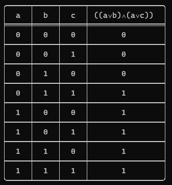

# Truth table of logical connectives

`truthtable` is a tool for printing [truth table](https://en.wikipedia.org/wiki/Truth_table) of combining logical connectives including (And, Or, Implication, Not).

## Usage
```haskell
λ> import TruthTable
λ> truthTable (TAnd (TVar A) (TVar B))
```


```haskell
λ> import TruthTable
λ> truthTable (TNot (TVar A))
```


```haskell
λ> import TruthTable
λ> truthTable (TAnd (TOr (TVar A) (TVar B)) (TOr (TVar A) (TVar C)))
```


## TODO
- [ ] Add tests
- [ ] Add multi color support
- [ ] Add parser